# QR 코드와 OCR을 활용한 명함 관리 애플리케이션

## 프로젝트 설명
이 프로젝트는 OCR을 이용하여 명함을 등록하고 QR코드를 상대방에서 보여줌으로써 명함 교환할 수 있는 애플리케이션이다.
명함을 교환할 때 한 사람만 QR코드 등록을 하면 자동으로 두 사람 명함 리스트에 상대방의 명함이 추가된다.
또한 실물 명함을 등록할 때 OCR을 통해 글자를 인식하여 편의성을 높였다.

## 목차
* [기능 구현](#기능-구현)
* [화면 구성](#화면-구성)
* [개선점](#개선점)

## 기능 구현
사용한 라이브러리는 다음과 같다. 
* 통신을 위한 Retrofit
* QR코드 Zxing
* OCR Tesseract

다음은 액티비티별로 구현한 기능들이다.

- 로그인 액티비티

    - 로그인 : 아이디,비밀번호를 입력받아 서버에 요청하여 맞는 아이디,비밀번호가 있으면 로그인한다.

    - 자동로그인 : SharedPreferences를 이용하여 '자동 로그인 체크박스'에 체크가 되어있는지 확인한다.  
    체크가 되어 있을 경우 저장해둔 토큰을 이용하여 서버에 토큰값을 전송하고 로그인한다.

- 회원가입 액티비티

  - 회원가입 : 회원가입에 필요한 정보를 받고 그 정보를 바탕으로 회원가입한다.  
    아이디, 비밀번호, 비밀번호 확인칸은 필수이다.

- 메인액티비티

    - 로그아웃 : 로그아웃할 경우 SharedPreferences에 저장해둔 정보를 삭제한다.

- 1프래그먼트

    - 내가 가진 타인명함 리스트 보기 : 서버에서 내 아이디 정보를 이용하여 내가 소유한 타인 명함 리스트를 받아온다.

    - 타인 명함 상세보기 : 명함의 고유값을 이용하여 특정 명함의 상세한 정보를 받아온다.

    - 타인 명함 삭제 : 명함의 고윳값을 이용하여 서버에 삭제를 요청한다.

- 2프래그먼트
 
    - 타인명함 QR코드로 등록 : QR코드를 읽어와 명함을 교환한다.  
    상대방 명함 리스트에 내 명함을 추가하고, 내 명함 리스트에 상대방 명함을 추가한다.

    - 내가 가진 내 명함 삭제 : 서버에 명함 삭제 요청을 한 뒤 명함을 삭제한다.

- 3프래그먼트

    - 내 명함 등록 (수동/OCR) : 명함 등록 방법은 2가지이다. 
    먼저 수동으로 모두 타이핑하는 방법이다. 회원가입시 적은 회원정보가 이미 포함되어 있는 상태로 내 명함을 등록한다.
    2번째는 OCR을 이용한 방법이다. 실물 명함을 카메라로 촬영하여 OCR로 글자를 추출한다.  
    추출한 글자 리스트를 보여주며 클릭시 클립보드에 복사한다. 복사된 글자를 붙여넣기를 통해 내 명함을 등록한다.
    등록된 명함은 자동으로 그 명함에 해당하는 QR코드가 생성된다. 등록된 명함은 2번째 페이지에서 확인할 수 있다.

    회원정보 수정 : 아이디 고윳값을 서버에 전송하여 회원 정보를 받아온다. 회원 정보를 수정한 뒤 다시 서버에 회원 정보 수정을 요청한다.

## 화면 구성

화면 구성은 다음과 같다.  

### 로그인화면 및 회원가입 화면

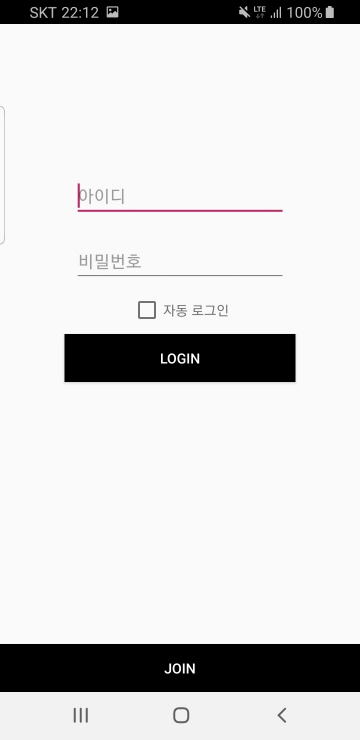
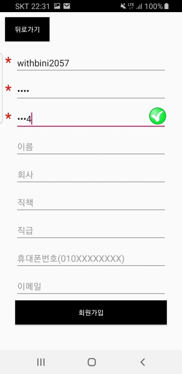
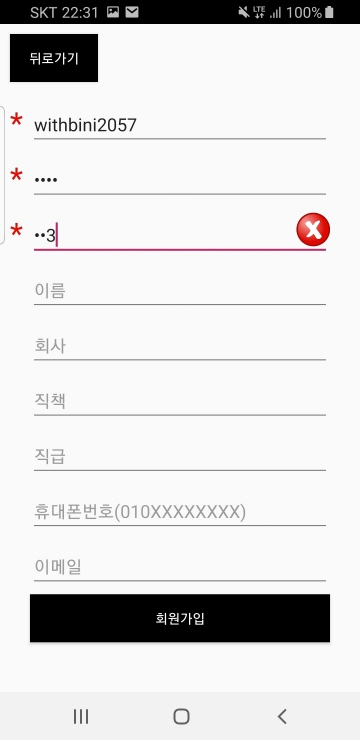

로그인화면과 회원가입 화면이다.
로그인화면에서는 자동로그인을 체크해두면 자동로그인할 수 있게 해두었다.  
회원가입화면에서는 '아이디','비밀번호','비밀번호 확인'을 필수적으로 받게 하였으며, 비밀번호와 비밀번호 확인이 같은지 체크표시를 한다.

 

### 명함 리스트

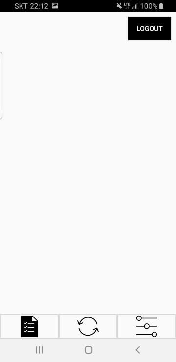
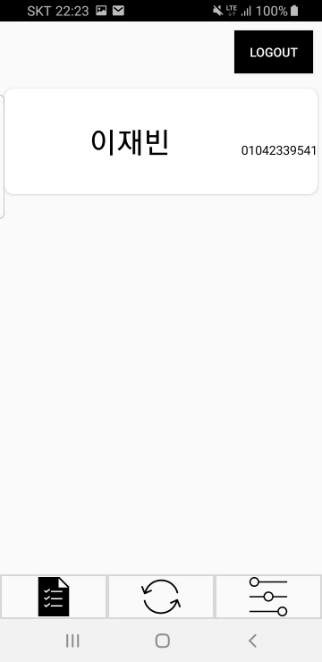
 
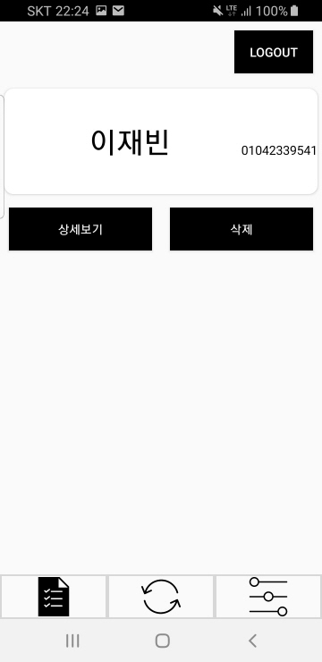
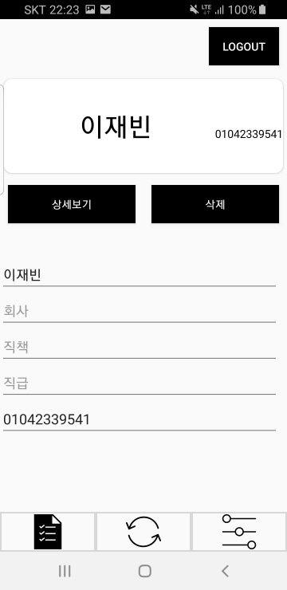

첫번째 화면은 명함리스트이다. 사용자가 소유하고 있는 타인의 명함 리스트를 보여준다.
명함리스트에서는 이름, 전화번호를 보여준다.  
recycleview로 구현하였으며, 명함을 클릭하면 그 명함에 대한 상세정보확인 및 삭제를 할 수 있다.  
 

### 내 명함 확인 및 타인 명함 등록
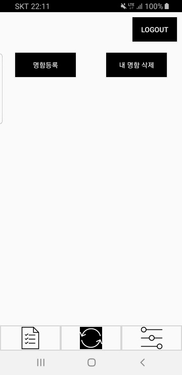
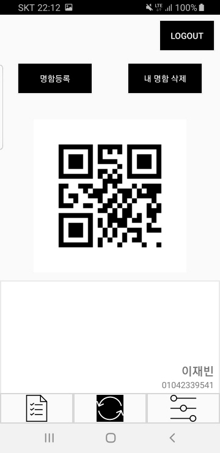

2번째 프래그먼트는 '타인의 명함을 등록'하는 버튼과 '내 명함 삭제' 및 '교환할 명함 선택'을 할 수 있다.
타인 명함 등록 버튼을 클릭하면 QR코드를 읽는 카메라창이 뜨고 유효한 QR코드이면 자동으로 서버에 등록 요청을 한다.  
내 명함 삭제는 현재 화면에 보여지고 있는 내 명함을 삭제할 때 사용한다.
이 때 다이얼로그가 뜨며 명함을 삭제할지 선택한다.  
교환할 명함 선택은 ViewPager와 PageAdapter로 구현하였으며 좌우로 화면을 슬라이딩하여 교환할 명함을 선택할 수 있다.  

### 내명함 등록 및 회원정보 수정

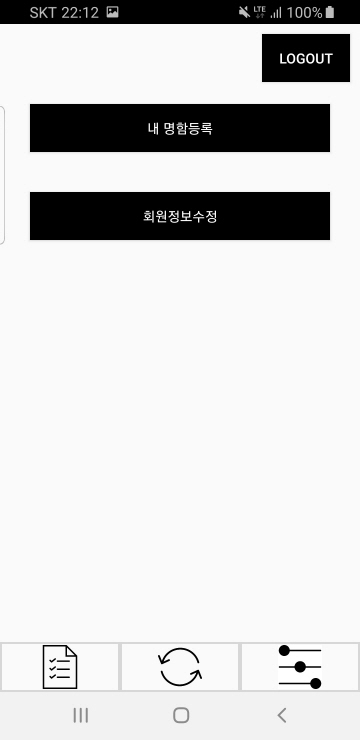

3번째 프래그먼트는 내명함 등록과 회원정보를 수정할 수 있는 프래그먼트이다.  
'내 명함 등록' 버튼과 '회원정보 수정' 버튼을 통해서 액티비티가 생성된다.

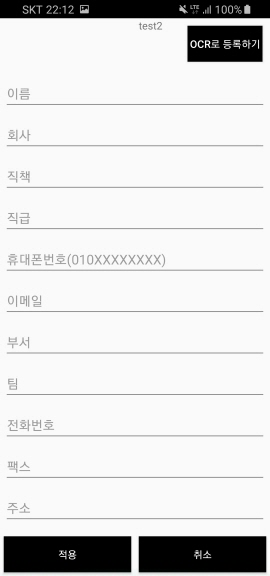
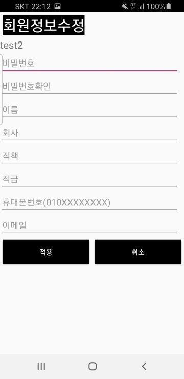

내 명함등록 버튼을 누르면 먼저 수동으로 입력할 수 있는 텍스트뷰를 볼 수 있다.  
명함등록 정보는 먼저 회원가입때 아이디,비밀번호 외 개인정보를 적었다면 해당 정보가 채워져있다.
그리고 OCR 버튼으로 실물 명함을 찍으면 클립보드로 복사할 수 있는 명함 정보를 선택할 수 있다.
 
회원정보 수정을 누르면, 기존의 회원가입 정보를 서버에 요청하여 채워진다.  
그리고 사용자가 원하는대로 수정하여 적용을 누르면 서버에 새로운 회원의 정보가 업데이트된다. 

## 개선점
* 명함인식 개선

Tesseract OCR의 경우 영어인식은 매우 잘되나, 한글인식이 잘 안되는 단점이 있다.
이에 대한 개선으로 opencv를 활용하는 방법을 생각해볼 수 있다.
인식에서 중요한 것은 정면으로 글자가 기울지 않게 한다는 것이다.
실제로 Tesseract 측에서도 제시하
사실 카메라로 찍다보니 몇가지 문제가 발생한다. 카메라가 기울져있을 수도 있고, 명함을 정면이 아닌 다른 각도에서 찍는 등의 변환이 일어날 수 있다. 이런 변환에 대처하기 위해 opencv를 활용할 수 있다.  
방법은 다음과 같다.
1. 명함 테두리를 인식하여 변환행렬을 구한뒤 명함을 정면으로 찍은 이미지를 구한다. 
2. 이후 이 이미지를 tesseract OCR을 거쳐 인식된 글자들을 얻는다.  

위 방법을 사용하면, 좀 더 깨끗한 이미지를 얻을 수 있으므로 좋은 결과가 나올 것으로 생각한다.

* 검색기능

명함의 역할을 생각해보면 어떤 사람과 연락을 취하기 위한 용도이다.
명함리스트에서 사용자가 찾고싶은 사람을 열심히 스크롤해서 찾아야한다면 굉장히 불편할 것이다.   
그래서 검색 기능을 추가하고 그 사람에게 바로 연락을 취할 수 있다면 명함 관리 애플리케이션을 넘어 좀 더 실용적인 앱이 될 것이다.

<!--## Reference
* https://github.com/tesseract-ocr
-->

궁금한 사항은 아래 메일로 보내주시길 바란다. wpql2057@naver.com